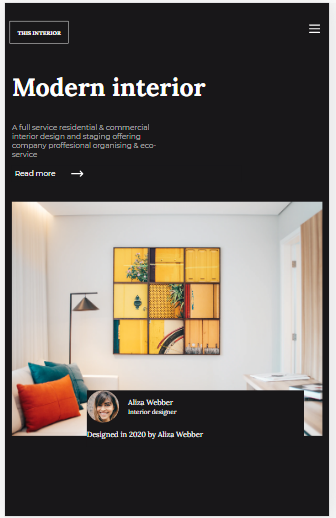
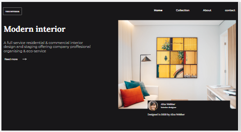

# Responsive Challenge : Interior Consultant

1- Feature for the mobile



2- Feature for the desktop



## **Source** 
Icon: https://google.github.io/material-design-icons/

[Check the design link here](https://www.figma.com/file/3cf83hHRBAGjG5EKPcG2bV)


## How To Use

<!-- Example: -->

To clone and run this application, you'll need [Git](https://git-scm.com) and [Node.js](https://nodejs.org/en/download/) (which comes with [npm](http://npmjs.com)) installed on your computer. From your command line:

```bash
# Clone this repository
$ git clone https://github.com/your-user-name/your-project-name

# Install dependencies
$ npm install

# Run the app
$ npm start
```

## Acknowledgements

<!-- This section should list any articles or add-ons/plugins that helps you to complete the project. This is optional but it will help you in the future. For example: -->

## Contact

-   Website [your-website.com](https://{your-web-site-link})
-   GitHub [@your-username](https://github.com/tiarah-funny)
-   Twitter [@your-twitter](https://{twitter.com/your-username})
